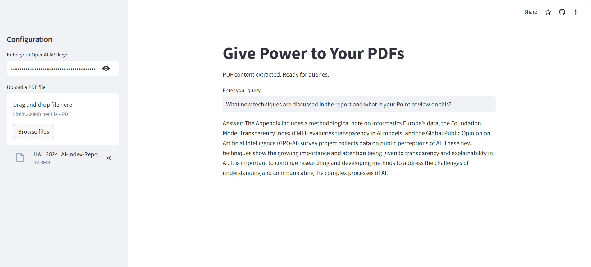

# Give Power to Your PDFs

Welcome to "Give Power to Your PDFs," a Streamlit app designed to transform how you interact with PDF documents. This application allows you to upload PDF files, extract and process the text, and use advanced language models to answer questions based on the content of the PDFs.

## Features

- **PDF Upload**: Simple interface to upload PDF documents.
- **Text Extraction**: Efficient extraction of text from each page of the PDF.
- **Text Chunking**: Automatic splitting of text into manageable chunks for better processing.
- **Interactive Querying**: Ask natural language questions and receive relevant answers extracted from the PDF content.
- **OpenAI Integration**: Leverages OpenAI's language models for high-quality text analysis and question answering.

## Use Case

Imagine you have a PDF containing detailed research papers, legal documents, or technical manuals. You need to quickly find specific information or summarize key points. With this app, you can:

1. **Upload Your PDF**: Drag and drop your document into the upload area.
2. **Ask Specific Questions**: For example, "What are the main findings in the research study?" or "Summarize the introduction section."
3. **Receive Answers**: Get precise and contextually relevant answers based on the content of your PDF.

### Example

Suppose you have a PDF report on the latest advancements in artificial intelligence. You can upload this report to the app and ask questions such as:

- "What new techniques are discussed in the report?"
- "What are the key challenges mentioned in the AI field?"

The app will process your queries and provide you with accurate answers directly from the PDF content.



## Requirements

- Python
- Streamlit
- PyPDF2
- LangChain
- FAISS
- OpenAI API key

## Installation

1. **Clone the repository**:
    ```bash
    git clone https://github.com/amishkr22/Langchain-PDF-Query-.git
    cd give-power-to-your-pdfs
    ```

2. **Install the required packages**:
    ```bash
    pip install -r requirements.txt
    ```

3. **Set up your OpenAI API key**: Obtain an API key from OpenAI. [Sign up here](https://platform.openai.com/signup) if you don't have one.

## Usage

1. **Run the Streamlit app**:
    ```bash
    streamlit run app.py
    ```

2. **Interact with the app**:
    - **Enter your OpenAI API key** in the sidebar for authentication.
    - **Upload a PDF file** through the file uploader interface.
    - **Enter your query** in the text input field to get responses from the document's content.

## Code Explanation

- **`PdfReader`**: Handles extraction of text from the uploaded PDF file.
- **`CharacterTextSplitter`**: Splits the extracted text into chunks to facilitate efficient querying.
- **`FAISS`**: Implements a vector store to perform similarity searches on text chunks.
- **`OpenAIEmbeddings`**: Provides vector representations of the text for the FAISS search.
- **`load_qa_chain`**: Loads the question-answering chain from OpenAI to generate responses.
- **`OpenAI`**: Utilizes OpenAI's language model to provide accurate answers to user queries.

## Example Project

For a live example and demonstration, visit our [project page](https://odqxdpghf5ykesctkyemwa.streamlit.app) to see the app in action and explore more use cases.

## Contributing

Contributions are welcome! If you have suggestions, improvements, or want to report issues, please open an issue or submit a pull request.

## Acknowledgments

- [Streamlit](https://streamlit.io/)
- [PyPDF2](https://github.com/py-pdf/PyPDF2)
- [LangChain](https://github.com/langchain/langchain)
- [FAISS](https://github.com/facebookresearch/faiss)
- [OpenAI](https://openai.com/)

## Contact

For questions or feedback, reach out to [amishkumar1028@gmail.com](mailto:amishkumar1028@gmail.com).
